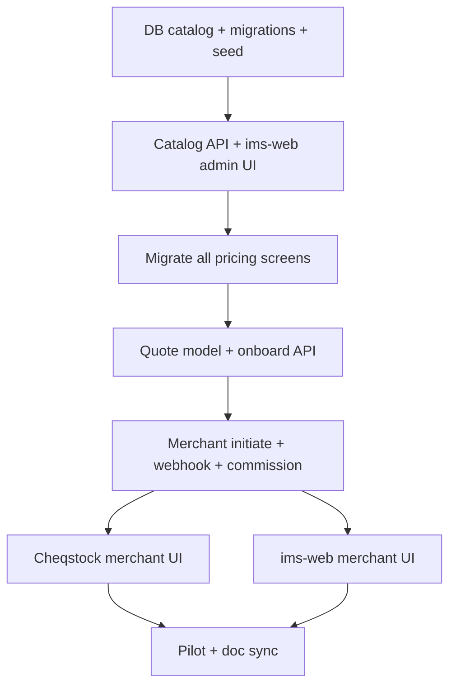

# Merchant onboarding, pricing config & one-charge payment

**Status:** Implemented (v1) — run migration `apps/api/migrations/20260526_billing_catalog_onboarding_quotes.sql` before use.  
**Last updated:** 2026-05-20 (pricing surfaces inventory added)  
**Related:** [AGENT_PARTNER_PROGRAM.md](./AGENT_PARTNER_PROGRAM.md) · [PRICING_PACKAGES.md](./PRICING_PACKAGES.md) · [USER_TYPES_AND_CREATION.md](./USER_TYPES_AND_CREATION.md) · [SUBSCRIPTION_TIERS_FEATURES.md](./SUBSCRIPTION_TIERS_FEATURES.md)

---

## Purpose

Enable **field agents** (and platform admins) to onboard businesses with a **selected plan** and **optional add-ons**, then collect **one combined Paystack charge** (onboarding + first-month subscription + add-ons). Support **Free** tier onboarding with **pay-later** add-on assistance. Expose **DB-driven pricing** and an admin UI gated by `tenants.directory.view`. Ship **v1 on Cheqstock and ims-web**.

---

## Confirmed product decisions

| # | Topic | Decision |
|---|--------|----------|
| 1 | Checkout model | **Single charge** per quote (one Paystack transaction) |
| 2 | Agent UX | Select **plan** + tick **add-ons**; show live total before onboard/collect |
| 3 | Pricing source | **All** subscription monthly amounts, onboarding fees, and add-on prices (including migration) are **configurable in the database** — not hard-coded in app constants |
| 4 | Pricing admin UI | Platform UI to manage catalog; gated by **`tenants.directory.view`** |
| 5 | Card checkout email | Use **tenant owner email**; show email on screen with **copy** (and share link alongside `redirect_url`) |
| 6 | Failed payment retry | **Same quote**; each retry creates a **new `transaction_ref`** / payment row |
| 7 | Free tier | Allow onboard on **Free** with **no upfront charge**; enable **charge later** when the business wants paid assistance (add-ons only, or revised quote) |
| 8 | Clients (v1) | **Cheqstock** merchant flow + **ims-web** merchant onboard/collect |
| 9 | Agent commission | **15%** one-time on onboarding line; **10%** on first subscription month line; **0%** on add-on lines (unless policy changes later) |
| 10 | Payout policy | Digital channels to Shopynn only; monthly settlement; **~30-day** clawback on onboarding commission per [AGENT_PARTNER_PROGRAM.md](./AGENT_PARTNER_PROGRAM.md) |
| 11 | Pricing display | **Every UI that shows list/catalog prices** must load from the billing catalog API (or server-built quote), not hard-coded constants — see [Phase 1b](#phase-1b--pricing-surfaces-migration-all-screens) |

---

## Already shipped (do not regress)

- Premium gating for customer signup / warehouse reference codes (`orders.create` feature).
- Reference code validation (min 6 characters).
- API + mobile numeric normalization for products and low-stock.
- **Tenant owner** subscription Paystack flow on Cheqstock / ims-web (`POST /api/payments/initiate` bound to `req.user.tenant_id`).
- Merchant `POST /api/merchants/onboard` (tenant + pending subscription + commission stub) — **no payment step yet**.

---

## Gap summary

| Area | Today | Target |
|------|--------|--------|
| Pricing | Plan amounts in subscription/onboard logic + **6+ UI constant files** + Shopynn landing | **DB catalog** + admin UI + **all screens in Phase 1b** |
| Merchant pay for onboarded tenant | `initiate` uses agent’s `tenant_id` | **Merchant-scoped initiate** for target `tenant_id` |
| Quote / line items | None | **Quote** with plan + add-ons + totals |
| Add-ons after Free onboard | N/A | **Add-on-only quote** + collect later |
| Commission | Single % on subscription `amount` | Split lines: 15% / 10% / 0% on success only |
| ims-web merchant | Limited / portal only | **Full parity** with mobile onboard + collect |

---

## Phase 1 — Pricing catalog (database)

### 1.1 Schema (conceptual)

**`billing_catalog_items`** (or split tables if preferred later)

| Column | Notes |
|--------|--------|
| `id` | UUID |
| `code` | Stable key, e.g. `plan_basic_monthly`, `onboarding_standard`, `addon_csv_import`, `addon_data_migration` |
| `item_type` | `subscription_monthly` \| `onboarding` \| `addon` |
| `plan_tier` | Nullable; links to subscription type / tier (Basic, Standard, Premium, Free) |
| `label` | Display name |
| `description` | Optional; shown in agent UI |
| `amount_ghs` | Numeric; **migration** and any item admin-editable |
| `min_amount_ghs` / `max_amount_ghs` | Optional bounds for migration-style add-ons |
| `commission_eligible` | `onboarding_15` \| `subscription_first_month_10` \| `none` |
| `is_active` | Soft-disable without deleting history |
| `sort_order` | UI ordering |
| `updated_at` / `updated_by` | Audit |

**Rules**

- Monthly subscription charges for onboard/checkout read **`subscription_monthly`** rows for the selected plan.
- Onboarding fee reads **`onboarding`** row for that plan.
- Add-ons read **`addon`** rows; agent selects by `code` at quote time.
- **Migration** add-on: fully configurable `amount_ghs` (and optional min/max); admin can set default in catalog; optional per-quote override only if product later requires approval workflow (v1: catalog amount only).

**Seed / migration**

- Seed initial rows matching current commercial intent (see [PRICING_PACKAGES.md](./PRICING_PACKAGES.md) and agent program examples).
- Existing `subscriptions.amount` for new onboarded tenants should be derived from catalog at quote creation time (snapshot on quote lines).

### 1.2 API (platform)

| Method | Path | Permission | Purpose |
|--------|------|------------|---------|
| GET | `/api/billing/catalog` | `tenants.directory.view` (read); merchants may need read-only subset for agent UI | List active catalog |
| PUT/PATCH | `/api/billing/catalog/:id` | `tenants.directory.view` | Update amounts, labels, active flag |
| POST | `/api/billing/catalog` | `tenants.directory.view` | Create add-on or new catalog row (if allowed) |

**Agent/merchant read:** `GET /api/billing/catalog` returns **active** items for any authenticated user with **`merchants.operate`**, **`tenants.directory.view`**, or **tenant owner billing** permission (exact code TBD — align with `subscription.view`). No hard-coded fallbacks in clients except optional loading skeleton.

**Optional:** `GET /api/billing/catalog/public` for Shopynn marketing site (unauthenticated, active rows only) — if omitted in v1, Shopynn landing can call a cached build-time fetch or share the authenticated pattern for trial signup only.

### 1.3 ims-web admin UI

- New section under **Admin / Tenant directory** area (navigation already uses `tenants.directory.view`).
- Table: code, type, plan, label, amount (GHS), active, commission class.
- Inline edit / save; validation on amounts ≥ 0; migration respects min/max if set.
- No implementation in this doc — UI spec only.

### 1.4 Backend: retire hard-coded `SUBSCRIPTION_TYPES` amounts

| File | Change |
|------|--------|
| `apps/api/src/models/subscription.js` | `SUBSCRIPTION_TYPES` amounts read from **`billing_catalog_items`** (`subscription_monthly` + `onboarding` per tier) at onboard/upgrade; keep type `1–4` keys |
| `onboardSubscriptionService` / `upgradeSubscriptionService` | New subscription row `amount` = catalog monthly price **at creation time** (snapshot) |
| Proration | Continue using **stored** `subscriptions.amount` on the active row (correct for mid-cycle upgrades) |
| `merchant.js` onboard commission | Use **quote line totals**, not `subscription.amount × percent` |

---

## Phase 1b — Pricing surfaces migration (all screens)

Hard-coded GHS values today live in shared constants duplicated across apps. After the catalog exists, **pickers and marketing copy** must use the API; **historical displays** may continue to show the tenant’s **stored** `subscription.amount` / payment rows (what they were charged).

### Display rules

| Context | Source |
|---------|--------|
| Plan picker, upgrade cards, signup labels, landing pricing | **`GET /api/billing/catalog`** (group by `plan_tier` + `item_type`) |
| Checkout / Paystack initiate | **Quote `total_ghs`** or server-computed from catalog (never client-sum trust) |
| Current plan card, payment history, tenant directory | **API subscription/payment record** (snapshot — may differ from today’s catalog) |
| Merchant quote / collect payment | **Quote lines** + catalog for new selections |
| Agent PDF / static docs | Manual regen when catalog changes ([Phase 6](#phase-6--ops-docs--pilot)) |

### Shared client pattern (all apps)

1. Add **`useBillingCatalog()`** / Redux slice / RTK query: fetch on app load or screen focus; cache ~5–15 min; refetch after admin save.
2. Replace `MONTHLY_SUBSCRIPTION_AMOUNTS_GHS`, `CHOOSEABLE_*`, inline `PLANS` arrays with **builders** from catalog rows.
3. Keep **`subscription_type` 1–4** as stable keys; map catalog `plan_tier` ↔ type number.
4. Deprecate (do not delete until migrated): `apps/mobile/src/constants/subscriptionPlans.js`, `apps/web/.../billing/subscriptionPlans.ts`, duplicated arrays in `shopynn/src/lib/ims-api.ts`.

---

### ims-services (API & docs)

| Location | Shows prices today? | Migration |
|----------|---------------------|-----------|
| `src/models/subscription.js` — `SUBSCRIPTION_TYPES` | Yes (229/429/799) | Read catalog; fallback only in seed migration |
| `docs/API.md`, `TENANT_ONBOARDING.md` | Documented amounts | “Configured in billing catalog”; example values as defaults |
| `POST /api/subscriptions/onboard` response | Returns `amount` on created sub | Amount from catalog at create |
| `GET /api/subscriptions/current` | Returns `subscription.amount` | No change (snapshot) |
| **New** `GET/PUT /api/billing/catalog` | — | Admin + client read |

---

### Cheqstock (React Native)

| Screen / file | Route / entry | What displays amounts | Migration |
|---------------|---------------|------------------------|-----------|
| **Subscription** | Settings → Subscription (`subscription.js`) | `CHOOSEABLE_SUBSCRIPTION_PLANS` — plan cards, upgrade list, amount in header, navigates to Payment with `amount` | Load catalog; map to plan cards; pass catalog amount to Payment |
| **Payment** | `Payment` (`payment.js`) | `route.params.amount`, plan name | Keep param-driven; upstream must pass catalog/quote amount |
| **PaymentWebView / MomoProcessing** | After initiate | Indirect (amount on prior screen) | No change if params correct |
| **Shop owner signup** | Auth → shop owner signup (`shop_owner_signup.js`) | `SUBSCRIPTION_PLANS` labels (“GHS 229/mo”) | Build labels from catalog |
| **Merchant onboard** | Settings → Clients → onboard (`merchant_onboard.js`) | Local `PLANS` — `GHS 229.00` etc. | Catalog + add-on ticks + **quote total** (new) |
| **Merchant portal** | `merchant_portal.js` | `subscription_amount`, commission `base_amount` from API | Show **quote status/total** when pending; keep stored amounts for paid |
| **Profile** | Settings → Profile (`profile.js`) | Plan name; last payment amount from billing API | Plan name OK; amounts from API records |
| **Settings hub** | `settings.js` | Text only (“onboarding & commissions”) | No amounts |
| **Customer signup upgrade card** | Warehouse create/edit | “Upgrade to Premium” (no GHS) | Optional: “from GHS X” via catalog Premium monthly |
| `constants/subscriptionPlans.js` | Imported everywhere above | All hard-coded GHS | Thin wrapper → catalog hook or delete after migration |

**Not in scope:** Dashboard/sales/product screens that show **product** GHS prices (unrelated to subscription catalog).

---

### ims-web (control panel)

| Screen / file | Route | What displays amounts | Migration |
|---------------|-------|------------------------|-----------|
| **Subscription (billing)** | Profile → Billing — `SubscriptionSection.tsx` | `CHOOSEABLE_SUBSCRIPTION_PLANS`, `GHS {plan.amount}`, payment history rows | Catalog-driven plan cards; navigate to Payment with catalog amount |
| **Payment** | `/apps/profile/billing/payment` — `Payment.tsx` | Query `amount` or `sub.subscription.amount` | Prefer quote/checkout param; else current sub snapshot |
| **Billing catalog admin** | **New** under tenant directory | — | Full CRUD table (Phase 1.3) |
| **Merchants list** | `/merchants` — `MerchantsPage.tsx` | `subscription_amount` per onboarded tenant | API snapshot; optional badge “quote pending ₵X” |
| **Merchant detail** | `/merchants/:id` — `MerchantDetailPage.tsx` | Same | Same |
| **Tenant directory** | Admin tenants list — `TenantsDirectoryPage.tsx` | `subscription_amount` column | API snapshot (historical) |
| **Tenant detail dialog** | `TenantDirectoryDetailDialog.tsx` | `subscription.amount` | API snapshot |
| **Merchant onboard (new)** | `/merchants/onboard` | — | Catalog plans + add-ons + total (Phase 5) |
| **Merchant collect (new)** | `/merchants/tenants/:id/collect` | — | Quote total, owner email copy, card link |
| `billing/subscriptionPlans.ts` | Shared import | 229/429/799 | Deprecate → catalog API |
| **Plan billing tab** | Settings → Plan & Billing — `PlanBillingTab.tsx` | Fuse template **$9 / $29 / $99** | **Out of scope** — demo/settings scaffold, not Shopynn pricing; do not wire to catalog unless product replaces template |

---

### Shopynn (marketing / trial signup)

| Screen / file | What displays amounts | Migration |
|---------------|------------------------|-----------|
| **Landing pricing** | `shopynn/src/components/landing/pricing.tsx` — “GHS 229”, “GHS 429”, “GHS 799” | Fetch catalog or SSR props from `GET /api/billing/catalog/public` |
| **Start trial** | `start-trial-page.tsx` + `ims-api.ts` `SUBSCRIPTION_PLANS` labels | Dynamic labels from catalog |
| `shopynn/src/lib/ims-api.ts` | Hard-coded plan labels | Remove amounts from constants; helper `formatPlanLabel(catalogRow)` |

---

### Documentation & generated PDFs (not runtime UI)

| Asset | Action |
|-------|--------|
| [PRICING_PACKAGES.md](./PRICING_PACKAGES.md) | State catalog is source of truth; table = **default seed** only |
| [AGENT_PARTNER_PROGRAM.md](./AGENT_PARTNER_PROGRAM.md) | Ranges for onboarding OK for marketing; implement commission on **actual paid quote** |
| `docs/generate_agent_partner_pdf.py` | Regenerate after catalog/marketing sync |
| `docs/generate_proposal_pdf.py` (if used for sales) | Pull amounts from export or manual update |

---

### New screens (from this plan — catalog from day one)

| App | Screen | Amounts source |
|-----|--------|----------------|
| ims-web | Billing catalog admin | Edit catalog |
| ims-web + Cheqstock | Merchant onboard | Catalog + live quote total |
| ims-web + Cheqstock | Collect payment | Quote `total_ghs`; onboarding + sub + add-ons breakdown |
| ims-web + Cheqstock | Pay later (add-ons only) | Add-on catalog rows only |

---

### Phase 1b acceptance (pricing surfaces)

- [ ] Admin changes Basic **monthly** 229 → 249 in catalog → **Subscription** pickers on Cheqstock + ims-web show **249** without app release.
- [ ] Admin changes **onboarding_standard** → new merchant quote uses new fee.
- [ ] Tenant on old **229** subscription still shows **229** on profile/directory until they upgrade/pay new plan.
- [ ] Shopynn landing pricing matches catalog (or documents intentional marketing lag).
- [ ] No remaining `229` / `429` / `799` literals in `subscriptionPlans.js` / `subscriptionPlans.ts` / `merchant_onboard.js` `PLANS` (grep CI check optional).

---

## Phase 2 — Quotes & one-charge payment

### 2.1 Quote model

**`onboarding_quotes`**

| Column | Notes |
|--------|--------|
| `id` | UUID |
| `tenant_id` | Business being charged |
| `merchant_id` | Nullable for owner-initiated pay-later |
| `plan_tier` / `subscription_type` | Selected plan |
| `subscription_id` | Pending subscription created at onboard |
| `status` | `draft` \| `pending_payment` \| `paid` \| `cancelled` |
| `total_ghs` | Sum of lines (server-computed) |
| `owner_email` | Snapshot for card checkout + copy UI |
| `created_at` / `paid_at` | |

**`onboarding_quote_lines`**

| Column | Notes |
|--------|--------|
| `quote_id` | FK |
| `catalog_item_id` | FK (optional) |
| `code` | Snapshot |
| `line_type` | Same as catalog `item_type` / commission class |
| `label` | Snapshot |
| `amount_ghs` | Snapshot at quote time |
| `commission_eligible` | Snapshot |

**Quote types**

1. **Full onboard quote** — onboarding + first month + selected add-ons (paid plans).
2. **Free onboard quote** — total **0**; no initiate required at onboard; subscription Free active/pending per existing rules.
3. **Add-on-only quote (pay later)** — for Free (or any tenant needing help later): only add-on lines; single charge when agent/owner collects.

**Server rule:** Client sends `plan` + `addon_codes[]`; server builds lines from **DB catalog**, computes `total_ghs`, rejects tampered amounts.

### 2.2 Extend merchant onboard

**`POST /api/merchants/onboard`** (body additions)

- `subscription_type` / plan (including **Free**).
- `addon_codes`: string[].
- Response includes: tenant, user, subscription, **quote** (lines + total), commission **placeholders** (pending until payment).

**Free tier:** Skip payment initiation at end of onboard; quote status `paid` or `not_required` with zero lines; store selected add-ons only if you want ops visibility without charge (optional zero-amount lines vs omit — recommend **omit** until pay-later quote).

### 2.3 Merchant-scoped payment initiate

**`POST /api/merchants/tenants/:tenantId/payments/initiate`**

- Permission: `merchants.operate` + merchant linked to tenant via `merchant_commissions`.
- Loads latest **`pending_payment`** quote for tenant (or `quote_id` in body).
- `amount` = quote `total_ghs` (server-side only).
- `email` = quote `owner_email` (tenant owner).
- `subscription_id` from quote when first month included.
- Creates pending `payments` row + Paystack checkout (card `redirect_url` or MoMo charge).
- Paystack **metadata**: `quote_id`, `tenant_id`, `merchant_id`, `payment_kind: onboarding_checkout`.

**Owner-initiated pay-later (v1 minimum):** Same endpoint or `POST /api/payments/initiate` when `req.user.tenant_id` matches quote tenant and quote is add-on-only — detail at implement time; mobile/web owner “Pay for services” can mirror merchant collect.

### 2.4 Failed payment retry

- Quote stays **`pending_payment`**.
- Each initiate attempt: **new** `payments` row + **new** `transaction_ref`.
- Prior failed/abandoned payments remain for audit; do not reuse reference.
- UI: **Retry payment** button on merchant portal (Cheqstock + ims-web).

### 2.5 Card checkout UX (agent)

- After initiate: show **`redirect_url`** (open + share).
- Show **`owner_email`** with **copy to clipboard**.
- Copy helper text for WhatsApp: link + “pay with this email on checkout if asked”.

### 2.6 Webhook / success handler

On Paystack success for quote checkout:

1. Mark payment `success`.
2. Mark quote `paid`.
3. **Activate** pending subscription (first month + plan tier).
4. Finalize **commission** rows:
   - 15% of onboarding line total
   - 10% of first-month subscription line total
   - Add-ons: no agent commission
5. Set commission **payable_after** for onboarding portion (+30 days if clawback enabled).

**Add-on-only pay-later:** Success does not change plan tier; marks quote paid and triggers ops notification (migration/training fulfillment).

---

## Phase 3 — Commission model update

Replace single `default_commission_percent × subscription.amount` stub with **line-based** commission at payment success (keep `merchant_commissions` table; extend or add columns):

| Field | Purpose |
|--------|---------|
| `onboarding_commission_amount` | 15% of onboarding lines |
| `subscription_commission_amount` | 10% of first-month line |
| `status` | `pending` → `payable` → `paid` / `clawed_back` |
| `payable_after` | Especially onboarding slice |

Historical rows from old logic remain unchanged.

---

## Phase 4 — Cheqstock (merchant v1)

1. **Onboard business** — plan picker, add-on checkboxes (from catalog API), running total.
2. **Free** — complete onboard without payment screen.
3. **Paid** — navigate to **Collect payment** (MoMo + card link + email copy).
4. **Onboarded list** — status: unpaid quote / paid; **Retry** for failed payments.
5. **Pay later** — action on Free (or paid) tenant: “Request paid setup” → add-on-only quote → collect.

Reuse existing `Payment` / `MomoProcessing` / `PaymentWebView` patterns; new API module for merchant initiate + quotes.

---

## Phase 5 — ims-web (merchant v1)

Parity with Cheqstock in the same release:

| Screen | Route (suggested) | Permissions |
|--------|-------------------|-------------|
| Merchant portal / onboarded list | `/merchants` (existing) | `merchants.operate` |
| Onboard business | `/merchants/onboard` | `merchants.operate` |
| Collect payment | `/merchants/tenants/:id/collect` | `merchants.operate` |
| Pay later (add-ons) | Same collect flow with add-on-only quote | `merchants.operate` |
| Billing catalog admin | Under tenant directory admin | `tenants.directory.view` |

RTK Query API slice: catalog, quotes, merchant initiate — mirror patterns in `SubscriptionApi.ts` / billing Payment.

---

## Phase 6 — Ops, docs & pilot

1. Update [PRICING_PACKAGES.md](./PRICING_PACKAGES.md) to state amounts are **configured in admin catalog** (docs show defaults, not source of truth).
2. Agent PDF regeneration when marketing amounts change.
3. Settlement export: payable commissions by month.
4. Pilot: **2 agents**, **5 businesses** (mix of paid one-charge + Free + pay-later add-on).

---

## Implementation order (sprints)

| Sprint | Deliverable | Exit criteria |
|--------|-------------|---------------|
| **S1** | Catalog tables, seed, read API + subscription.js reads catalog | Plans/add-ons load from DB; new subs get catalog amounts |
| **S2** | ims-web catalog admin UI + **Phase 1b** apps/web/apps/mobile/shopynn picker screens | Admin can edit prices; subscription/signup/merchant onboard/landing show catalog values |
| **S3** | Quotes + extend `merchants/onboard` | Paid + Free onboard creates correct quote; Free total 0 |
| **S4** | Merchant initiate + retry + webhook | One charge activates subscription; retry uses new ref, same quote |
| **S5** | Cheqstock merchant collect + pay later | Agent E2E in staging |
| **S6** | ims-web merchant parity | Same E2E on web |
| **S7** | Pilot + commission settlement notes | Real payments; commission matches lines |

---

## Acceptance tests

- [ ] **Phase 1b:** Change Basic monthly in catalog → Cheqstock Subscription + ims-web Billing + Shopynn pricing update without redeploy.
- [ ] Change **Premium onboarding** amount in admin UI → next quote uses new value.
- [ ] **Migration** add-on price change reflects in agent tick list without deploy.
- [ ] **Standard + CSV + opening stock** → one charge = sum of three line types; Paystack success activates subscription.
- [ ] **Card:** owner email pre-filled; copy email + share link works.
- [ ] **MoMo failure** → retry creates new `transaction_ref`, same quote, second success activates tenant.
- [ ] **Free onboard** → no payment; later **add-on-only** quote charges only add-ons.
- [ ] Commission: 15% / 10% / 0% on respective lines after success only.
- [ ] Agent cannot initiate for tenant they did not onboard (unless admin policy added later).
- [ ] ims-web and Cheqstock produce identical quote totals for same selections.
- [ ] User without `tenants.directory.view` cannot open catalog admin UI.

---

## API checklist (implement later)

| Method | Path | Notes |
|--------|------|--------|
| GET | `/api/billing/catalog` | Active catalog for agents, owners, admins |
| GET/PUT | `/api/billing/catalog` (admin) | CRUD; `tenants.directory.view` |
| GET | `/api/billing/catalog/public` | Optional: Shopynn landing (v1 or fast-follow) |
| POST | `/api/merchants/onboard` | +plan +addons → quote |
| GET | `/api/merchants/tenants/:id/quote` | Active pending quote |
| POST | `/api/merchants/tenants/:id/quotes` | Add-on-only / pay-later |
| POST | `/api/merchants/tenants/:id/payments/initiate` | One charge; new ref per call |
| POST | `/api/payments/webhook` | Extend metadata handling for `quote_id` |

---

## Out of scope for v1

- Splitting onboarding and subscription into **two** Paystack charges.
- Agent commission on add-ons.
- Owner self-serve pay-later without merchant (optional fast-follow).
- Automated migration job scheduling (ops manual after payment).

---

## Review sign-off

| Role | Name | Date | Notes |
|------|------|------|--------|
| Product | | | |
| Engineering | | | |
| Finance / commissions | | | |
| Field agents (pilot) | | | |

---

*Implementation complete for v1; verify E2E in staging after applying the migration.*
