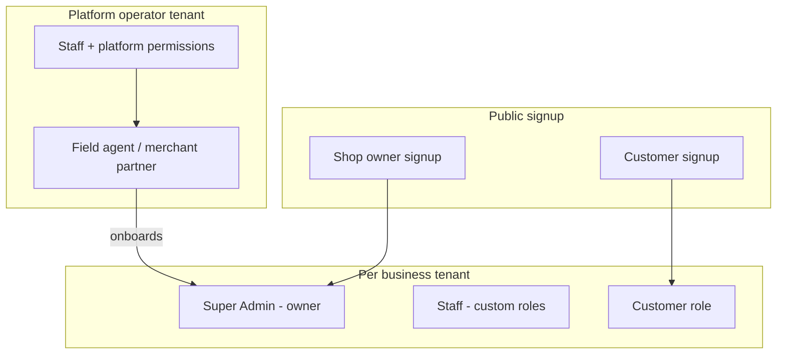

# User types and how to create them

Guide for operators, support, and developers: who can use Shopynn/Cheqstock, what each account type is for, and how accounts are created (mobile, web, API).

**Related:** [TENANT_ONBOARDING.md](../apps/api/docs/TENANT_ONBOARDING.md) · [PRICING_PACKAGES.md](./PRICING_PACKAGES.md) · [PRODUCTION_TEST_CHECKLIST.md](./PRODUCTION_TEST_CHECKLIST.md)

---

## 1. Overview — account categories

IMS does not use a single `user_type` column. A person is defined by:

| Dimension | What it means |
|-----------|----------------|
| **`users` row** | Login identity (email, phone, password) scoped to one **`tenant_id`** (except platform flows that share the operator tenant). |
| **`user_roles` + `roles`** | Permission sets (e.g. Super Admin, Customer, Field agent, custom “Manager”). |
| **`merchants` row** | Optional link: this user is a **merchant partner** who can onboard other businesses and earn commissions. |
| **`customer_profiles` row** | Optional link: this user is a **B2C customer** who shops via the customer portal (For You / orders). |
| **Subscription tier** | Tenant’s plan (Free / Basic / Standard / Premium) gates **features**, not the user row itself. |

---

## 2. User types (what each one is)

### 2.1 Shop owner / tenant owner (**Super Admin**)

| | |
|--|--|
| **Purpose** | Owns the business tenant; full staff access except B2C-only and platform-only permissions. |
| **Role** | Tenant-scoped **Super Admin** (created automatically at onboarding). |
| **Typical app** | Cheqstock (inventory, sales, settings) and ims-web control panel. |
| **Not included by default** | Customer-portal perms (`orders.view`, `orders.create`, …, `notifications.view` for shoppers), platform perms (`merchants.*`, `tenants.directory.view`, marketing inbox). |

Super Admin still gets **staff** order tools (`orders.store.*`, `orders.process`, etc.) and staff notifications (`notifications.mark_read`, `notifications.settings.*`) per current permission design.

---

### 2.2 Staff (custom roles)

| | |
|--|--|
| **Purpose** | Employees: cashiers, managers, warehouse staff, etc. |
| **Role** | Any **tenant-created role** (you define name + permissions). Legacy UI labels: Admin, Manager, Staff — authorization is **permission-based**, not role name. |
| **Typical app** | Cheqstock / ims-web per assigned permissions. |
| **Scoped by** | Usually one **`warehouse_id`** (store) on the user record. |

---

### 2.3 Customer (B2C shopper)

| | |
|--|--|
| **Purpose** | End customer who browses a linked store, places orders, may pay installments. |
| **Role** | Tenant-scoped **Customer** with `CUSTOMER_PORTAL_PERMISSION_CODES` only. |
| **Profile** | `customer_profiles` + `customer_store_access` (linked via **store reference code**). |
| **Typical app** | Cheqstock **For You** / cart / My Orders (customer flows), not the full back office. |

**Permissions (customer portal):** `orders.view`, `orders.create`, `orders.details.view`, `orders.cancel`, `notifications.view` (see `apps/api/src/constants/permissionCodes.js`).

---

### 2.4 Merchant partner / field agent

| | |
|--|--|
| **Purpose** | Sales partner who registers new businesses under your platform and tracks commissions. |
| **Role** | **Field agent** (tenant-scoped) with at least `merchants.operate`. |
| **Record** | Row in **`merchants`** (`user_id`, `default_commission_percent`). |
| **Typical app** | Cheqstock **Merchant portal** (onboard business, commissions). |

Does **not** replace Super Admin of onboarded businesses — each new business gets its **own** tenant + owner.

---

### 2.5 Platform operator staff

| | |
|--|--|
| **Purpose** | Your IMS/Shopynn team: tenant directory, all merchants, order payments admin, marketing tools (Premium). |
| **Role** | Usually **Super Admin** (or custom role) on the **operator tenant**, plus explicit **platform permissions** on that role. |
| **Platform permission codes** | `merchants.view`, `merchants.operate`, `tenants.directory.view`, newsletter/contact/chat codes (see `PLATFORM_PERMISSION_CODES` in `permissionCodes.js`). |
| **Typical app** | Cheqstock settings: Tenant directory, Merchants, Order payments; ims-web equivalents. |

These permissions are **never** auto-granted to a normal business’s Super Admin at signup.

---

## 3. How to create each type

### 3.1 Shop owner (new business / tenant)

Creates **tenant + subscription + first user (Super Admin) + Main warehouse**.

| Channel | Steps |
|---------|--------|
| **Cheqstock app** | Login → “Need an account?” → **Shop owner** → complete business + owner tabs → email OTP → submit. |
| **API** | `POST /api/users/shop-owner-signup/send-email-otp` → `verify-email-otp` → `POST /api/tenants/setup` (or `POST /api/tenants`) with `verification_token`, `subscription_type` (1–4), owner + business fields. |
| **Web** | Same tenant setup flow as your public landing (if wired). |

**Required:** `subscription_type`, owner name, email, business name, phone; **verification_token** for public signup.

**After create:** Owner logs in → company setup (if needed) → activate paid plan via Paystack if not Free.

**Detail:** [TENANT_ONBOARDING.md](../apps/api/docs/TENANT_ONBOARDING.md)

---

### 3.2 Staff user (existing tenant)

Creates **`users`** row in tenant; assigns **`role_id`** + **`warehouse_id`**; optional permission list on role.

| Channel | Steps |
|---------|--------|
| **Cheqstock** | Settings → **System users** → add user (`UserForm`) — requires `users.create` + plan features. |
| **ims-web** | User management → create user, pick role and store. |
| **API** | `POST /api/users` (auth + active subscription) with `first_name`, `last_name`, `email`, `phone`, `tenant_id`, `role_id`, `warehouse_id`, optional `user_permissions`, `email_credentials: true` for emailed temp password. |

**Prerequisites:** At least one **role** (create under Settings → **Roles & Permissions**) and one **warehouse** (auto-created as “Main warehouse” at onboarding).

**Limits:** Basic / Standard / Premium cap users per branch (see [PRICING_PACKAGES.md](./PRICING_PACKAGES.md)).

---

### 3.3 Customer (B2C)

Creates **user + Customer role + customer_profile + store access** for one tenant/store.

| Channel | Steps |
|---------|--------|
| **Cheqstock** | “Create account” → **Customer** → enter **store reference code** (6–80 characters, from business) + profile + password. |
| **API** | Optional: `POST /api/users/customer-signup/verify-reference` with `reference_code` → `POST /api/users/customer-signup` with `first_name`, `last_name`, `email`, `phone`, `password`, `reference_code`. |

**Prerequisites:** The store must have an active **customer signup code** on its warehouse (Settings → Warehouses → create/edit → **Customer signup code**). Managing signup codes requires the **Premium** plan (`orders.create` subscription feature — same as customer online ordering). If left blank on create, the API auto-generates a code for Premium tenants only. Customer ordering also requires **Premium** on the **store’s** tenant (see [PRICING_PACKAGES.md](./PRICING_PACKAGES.md)).

**Note:** Customers are **not** created via “System users”; they use the dedicated signup flow.

---

### 3.4 Merchant partner (field agent)

Two patterns: **create new field agent** or **promote existing staff user**.

| Channel | Steps |
|---------|--------|
| **Cheqstock / ims-web** | Merchant portal admin → **Add merchant** / promote user (UI calls API below). |
| **API — new field agent** | `POST /api/merchants/promote` with body `{ create_user: { first_name, last_name, email, phone }, default_commission_percent? }` — requires `merchants.view` on operator tenant. Creates user + **Field agent** role + `merchants` row; emails temp password. |
| **API — promote existing user** | `POST /api/merchants/promote` with `{ user_id, default_commission_percent? }` — adds `merchants` row only (user must already exist in tenant). |

**Field agent onboarding businesses:** Partner logs in → Merchant portal → **Onboard business** → `POST /api/merchants/onboard` (skips owner email OTP; same tenant setup as shop owner).

**Revoke:** `DELETE /api/merchants/admin/:id` (admin).

---

### 3.5 Platform operator access (grant to existing user)

Does not create a new “user type” — grants **platform permissions** to a role the user already has.

| Channel | Steps |
|---------|--------|
| **API** | `POST /api/users/assign-merchant-permissions` with `{ user_id, role_id }` — attaches `merchants.view`, `merchants.operate`, `tenants.directory.view` to that role and ensures user has the role. |
| **Manual** | Roles UI → edit role → add platform permission codes → assign role to user. |

Use on your **operator** tenant’s staff accounts only.

---

## 4. Roles reference

| Role name | Scope | Created when | Typical permissions |
|-----------|--------|--------------|------------------------|
| **Super Admin** | Per tenant | Shop owner / tenant onboarding | All staff permissions minus `SUPER_ADMIN_EXCLUDED` (customer portal + platform lists). |
| **Customer** | Per tenant | First customer signup for that tenant | `CUSTOMER_PORTAL_PERMISSION_CODES` only. |
| **Field agent** | Per tenant (operator) | First field agent create for that tenant | `merchants.operate` (extend via role editor). |
| **Custom** (e.g. Manager, Cashier) | Per tenant | Admin via Roles UI | Whatever you assign in `role_permissions`. |

**Authorization rule:** Apps check **permission codes** and **subscription features**, not role display names. `getUserPermissionsService` expands **Super Admin** to “all except excluded” even if `role_permissions` is incomplete.

---

## 5. Subscription tier vs user capabilities

Users inherit their **tenant’s** plan features (not per-user plans).

| Tier | Staff users | Customer online orders | Examples gated to Premium |
|------|-------------|------------------------|---------------------------|
| Free | Onboarding owner | No | Many advanced features |
| Basic | Up to 3 / 1 branch | No | Multi-store, many admin modules |
| Standard | Up to 12 / 5 branches | No | Still no full B2C order suite on lower tiers |
| Premium | Up to 25 / 10 branches | Yes | Notifications inbox, exports, `payments.view`, etc. |

See [PRICING_PACKAGES.md](./PRICING_PACKAGES.md) and `seed-permissions.sql` / `subscription_tier_features` for the canonical feature matrix.

---

## 6. Login and post-create behavior

| User type | Login | Post-login notes |
|-----------|--------|------------------|
| Shop owner / staff | `POST /api/users/login` | Temp password → forced change; subscription gate may block APIs until plan active. |
| Customer | Same login endpoint | Routed to customer tabs if permissions are portal-only (`merchants.operate` without `merchants.view` → Clients tab edge case for merchant-only staff). |
| Merchant partner | Same | `merchant_id` on session; Merchant portal + onboard flows. |
| Platform staff | Same | Tenant directory / merchants visible when role has platform perms + Premium features where required. |

---

## 7. Quick “how do I…” table

| Goal | Action |
|------|--------|
| New business on platform | Shop owner signup or merchant `POST /merchants/onboard` |
| Add cashier / manager | Staff: `POST /users` or app **System users** |
| Shopper for a store | Customer signup with **reference code** |
| New sales partner | `POST /merchants/promote` with `create_user` |
| Let support see all tenants | Grant platform permissions to operator role |
| Custom permission set | **Roles & Permissions** → create role → assign to user |

---

## 8. Troubleshooting

| Symptom | Likely cause |
|---------|----------------|
| Owner has no menus | `seed-permissions.sql` not applied or incomplete Super Admin `role_permissions` |
| Customer cannot place orders | Store tenant not **Premium**, or missing `orders.create` feature |
| Merchant cannot onboard | User missing `merchants` row or `merchants.operate`; subscription inactive |
| Super Admin sees “Premium required” on notifications | Expected on non-Premium; staff inbox needs `notifications.view` **feature** + `notifications.mark_read` or `notifications.settings.view` **permission** |
| Platform menus missing | Role lacks `tenants.directory.view` / `merchants.view` (not granted to business Super Admin by default) |

---

## 9. Key API endpoints (summary)

| Endpoint | Creates / grants |
|----------|------------------|
| `POST /api/tenants/setup` | Tenant + Super Admin owner |
| `POST /api/users` | Staff user |
| `POST /api/users/customer-signup` | Customer |
| `POST /api/merchants/promote` | Field agent or merchant record |
| `POST /api/merchants/onboard` | New tenant (by merchant) |
| `POST /api/users/assign-merchant-permissions` | Platform perms on role |
| `POST /api/roles` + `PUT .../permissions` | Custom roles |

Full list: [apps/api/docs/API.md](../apps/api/docs/API.md)

---

*Extend this doc when you add new signup paths or role templates.*
